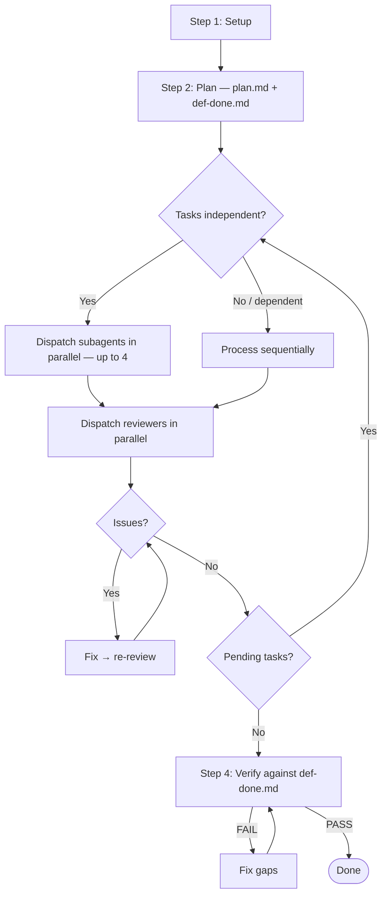

# Adopt Subagent Flow

Transform an existing skill into the adaptive parallel subagent architecture:



---

## Process

### 1. Analyze the Source Skill

Read the existing SKILL.md. Identify:

- **Unit of work**: What is the repeatable task? (e.g., "process one file", "review one component", "migrate one endpoint")
- **Setup phase**: What needs to happen once before tasks start? (load config, detect framework, build indexes)
- **Task dependencies**: Are tasks independent or do some depend on others' output?
- **Verification criteria**: What defines success for the entire workflow?

### 2. Restructure into 4 Steps

Rewrite the skill using this template:

#### Step 1 — Setup
Move all one-time initialization here: loading configs, building indexes, detecting frameworks, ensuring infrastructure. This runs once before any tasks.

#### Step 2 — Plan
Add these (new for most skills):
- **Scan for candidates** — find all units of work
- **Generate `plan.md`** — table of tasks with status tracking
- **Generate `def-done.md`** — checklist of success criteria (extracted from the skill's quality requirements)
- **Create TodoWrite entries** — one per task

#### Step 3 — Execute (Adaptive)
Replace the existing execution logic with:

```markdown
## Step 3 — Execute

**Parallel subagents by default.** Do NOT self-justify choosing direct mode —
"I prefer direct mode" or "more control" are never valid reasons.

> Dispatch independent tasks as parallel subagents (up to 4 at once).
> Only fall back to direct mode when:
> (a) subagent fails with `resource_exhausted`, or
> (b) tasks genuinely depend on each other's output.

**Per batch:**

1. Select up to 4 pending independent tasks from plan.md
2. Dispatch task-processor subagents in parallel (one per task)
3. Collect results
4. Dispatch reviewer subagents in parallel (one per completed task)
5. Fix issues: processor fix → reviewer re-review → repeat until approved
6. Update plan.md and TodoWrite

### Direct Mode (fallback)

> Only use when: (a) subagent failed with `resource_exhausted`, or
> (b) tasks are genuinely dependent. "I prefer direct mode" is not valid.

Process remaining tasks sequentially. Same logic, same quality checks.
Context management: filter inputs per task, read references on-demand,
retain only summary after each task.
```

#### Step 4 — Verify
Add def-done verification:
- Lint/check all changes
- Verify every criterion in def-done.md against actual state
- Fix gaps → re-verify → loop until PASS
- Final summary with results + skipped items

### 3. Create Subagent Prompt Templates

Create a `prompts/` directory with these templates:

#### `prompts/task-processor-prompt.md`

Template for the subagent that executes one unit of work:

```markdown
# Task Processor Subagent Prompt Template

Task tool:
  description: "[SKILL_NAME]: Process [TASK_ID]"
  prompt: |
    You are [DESCRIPTION OF WHAT THE SUBAGENT DOES] for a single [UNIT_OF_WORK].

    ## Task
    [TASK_DESCRIPTION]

    ## Context
    [MINIMAL CONTEXT — only what this task needs, not the full project state]

    ## Reference Files (read on demand)
    - [ABSOLUTE_PATH]/references/[file].md

    ## Your Job
    1. [Step 1]
    2. [Step 2]
    3. [Step N]
    4. Self-review: [checklist]

    ## Report
    - What was done
    - What was skipped (with reasons)
    - Any concerns for reviewer
```

#### `prompts/reviewer-prompt.md`

Template for the subagent that reviews one completed task:

```markdown
# Reviewer Subagent Prompt Template

Task tool:
  description: "[SKILL_NAME] review: [TASK_ID]"
  prompt: |
    You are reviewing whether [UNIT_OF_WORK] was completed correctly.

    ## CRITICAL: Do Not Trust the Report
    Verify everything independently by checking the actual output.

    ## Your Job
    1. Read the actual output
    2. Verify correctness against [CRITERIA]
    3. Check for missed items
    4. Check for collateral damage

    ## Report
    - APPROVED: All checks pass
    - ISSUES FOUND: List each with category, location, fix suggestion
```

#### `prompts/verifier-prompt.md`

Template for the final verification subagent:

```markdown
# Verifier Subagent Prompt Template

Task tool:
  description: "[SKILL_NAME]: Verify definition of done"
  prompt: |
    You are the final gate. Check every criterion in def-done.md
    against the actual state. Trust nothing from previous reports.

    ## Definition of Done
    [PASTE def-done.md]

    ## Plan
    [PASTE plan.md with statuses]

    ## Your Job
    Check each criterion. Report PASS or FAIL with evidence.
```

### 4. Update Skill Metadata

Update the SKILL.md frontmatter description to mention the adaptive execution.

### 5. Add Guard Rails

Add these sections to the transformed skill:

**Execution Strategy** (near the top):
```markdown
## Execution Strategy

**Parallel subagents by default.** Do NOT self-justify choosing direct mode.

1. After Step 2 → identify task dependencies
2. Independent tasks → dispatch subagents in parallel (up to 4)
3. Dependent tasks → process sequentially
4. resource_exhausted at runtime → fall back to direct mode
```

**Red Flags**:
```markdown
## Red Flags

**Never:**
- Skip the verification step
- Start verification before all tasks are processed
- Accept "close enough" (issues found = not done)
- Leave tasks as `pending` without processing or skipping
- Choose direct mode for preference ("more control" is not valid)
```

**Error Handling**:
```markdown
## Error Handling

- **Task failure**: Skip task, mark as skipped in plan.md, continue
- **Subagent resource_exhausted**: Switch to direct mode for remaining tasks
- **Verification failure**: Fix gaps, re-verify (loop until PASS)
```

### 6. Sync to Both Runtimes

Copy the transformed skill to both `.cursor/skills/` and `.claude/skills/`. They must be identical — the adaptive execution handles the runtime differences automatically.

---

## Checklist

Before finalizing the transformed skill:

- [ ] Step 1 (Setup) contains all one-time initialization
- [ ] Step 2 generates plan.md + def-done.md
- [ ] Step 3 defaults to parallel subagents with clear fallback rules
- [ ] Step 4 verifies against def-done.md
- [ ] Subagent prompts are concise (provide paths to references, not content)
- [ ] Red Flags section blocks self-justified direct mode
- [ ] `.cursor/` and `.claude/` versions are identical
- [ ] SKILL.md is under 500 lines

## Reference Implementation

See `convert-string-to-i18n` skill for a complete example of this architecture applied to i18n string replacement:
- [.cursor/skills/convert-string-to-i18n/SKILL.md](../convert-string-to-i18n/SKILL.md)
