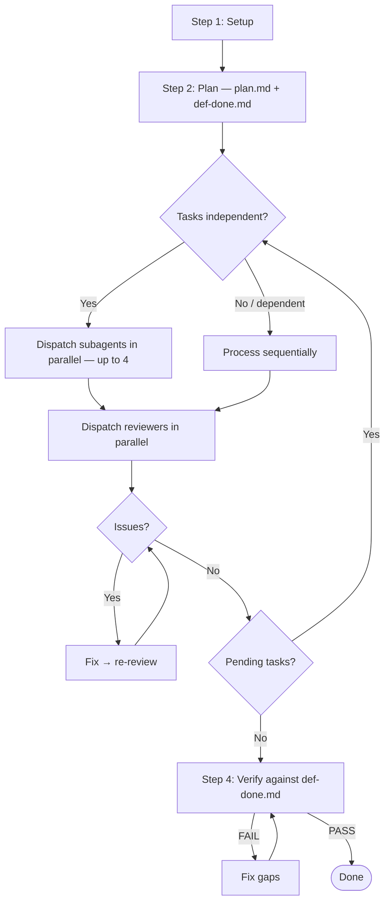

# Adopt Subagent Flow

Transform an existing skill into the adaptive parallel subagent architecture:



---

## Process

### 1. Analyze the Source Skill

Read the existing SKILL.md. Identify:

- **Unit of work**: What is the repeatable task? (e.g., "process one file", "review one component", "migrate one endpoint")
- **Setup phase**: What needs to happen once before tasks start? (load config, detect framework, build indexes)
- **Task dependencies**: Are tasks independent or do some depend on others' output?
- **Verification criteria**: What defines success for the entire workflow?

### 2. Restructure into 4 Steps

Rewrite the skill using this template:

#### Step 1 — Setup
Move all one-time initialization here: loading configs, building indexes, detecting frameworks, ensuring infrastructure. This runs once before any tasks.

#### Step 2 — Plan
Add these (new for most skills):
- **Scan for candidates** — find all units of work
- **Generate `plan.md`** — table of tasks with status tracking
- **Generate `def-done.md`** — checklist of success criteria (extracted from the skill's quality requirements)
- **Create TodoWrite entries** — one per task

#### Step 3 — Execute (Adaptive)
Replace the existing execution logic with:

```markdown
## Step 3 — Execute

**Parallel subagents by default.** Do NOT self-justify choosing direct mode —
"I prefer direct mode" or "more control" are never valid reasons.

> Dispatch independent tasks as parallel subagents (up to 4 at once).
> Only fall back to direct mode when:
> (a) subagent fails with `resource_exhausted`, or
> (b) tasks genuinely depend on each other's output.

**Per batch:**

1. Select up to 4 pending independent tasks from plan.md
2. Dispatch task-processor subagents in parallel (one per task)
3. Collect results
4. Dispatch reviewer subagents in parallel (one per completed task)
5. Fix issues: processor fix → reviewer re-review → repeat until approved
6. Update plan.md and TodoWrite

### Direct Mode (fallback)

> Only use when: (a) subagent failed with `resource_exhausted`, or
> (b) tasks are genuinely dependent. "I prefer direct mode" is not valid.

Process remaining tasks sequentially. Same logic, same quality checks.
Context management: filter inputs per task, read references on-demand,
retain only summary after each task.
```

#### Step 4 — Verify
Add def-done verification:
- Lint/check all changes
- Verify every criterion in def-done.md against actual state
- Fix gaps → re-verify → loop until PASS
- Final summary with results + skipped items

### 3. Create Subagent Prompt Templates

Create a `prompts/` directory with these templates. Follow the patterns from [subagent-driven-development](.agents/skills/subagent-driven-development/SKILL.md):

- **Fresh subagent per task** — each task gets its own subagent with clean context
- **Self-review before reporting** — processor must self-review before handing off
- **Questions before starting** — processor asks upfront if anything is unclear
- **"Do Not Trust the Report"** — reviewer verifies everything independently by reading actual code
- **Review loops** — fix -> re-review -> repeat until approved, never skip re-review

#### `prompts/task-processor-prompt.md`

Template for the subagent that executes one unit of work:

```markdown
# Task Processor Subagent Prompt Template

Task tool:
  description: "[SKILL_NAME]: Process [TASK_ID]"
  prompt: |
    You are [DESCRIPTION OF WHAT THE SUBAGENT DOES] for a single [UNIT_OF_WORK].

    ## Task
    [FULL TEXT of task — paste it here, don't make subagent read plan file]

    ## Context
    [Scene-setting: where this task fits, dependencies, architectural context.
     Only what this task needs, not the full project state.]

    ## Reference Files (read on demand)
    - [ABSOLUTE_PATH]/references/[file].md

    ## Before You Begin

    If anything is unclear about the requirements, approach, or
    dependencies — **ask now.** Don't guess or make assumptions.

    ## Your Job
    1. [Step 1]
    2. [Step 2]
    3. [Step N]

    **While you work:** If you encounter something unexpected or unclear,
    pause and ask. It's always OK to clarify mid-task.

    ## Before Reporting: Self-Review

    Review your work with fresh eyes before handing off:
    - **Completeness**: Did I fully implement everything? Missed requirements?
    - **Quality**: Is this my best work? Names clear? Code clean?
    - **Discipline**: Did I avoid overbuilding (YAGNI)? Only built what was requested?
    - **No collateral damage**: Did I break anything else?

    If you find issues during self-review, fix them now.

    ## Report
    - What was done
    - What was skipped (with reasons)
    - Self-review findings (if any)
    - Any concerns for reviewer
```

#### `prompts/reviewer-prompt.md`

Template for the subagent that reviews one completed task:

```markdown
# Reviewer Subagent Prompt Template

Task tool:
  description: "[SKILL_NAME] review: [TASK_ID]"
  prompt: |
    You are reviewing whether [UNIT_OF_WORK] was completed correctly.

    ## What Was Requested
    [FULL TEXT of task requirements]

    ## What the Processor Claims
    [From processor's report]

    ## CRITICAL: Do Not Trust the Report

    The processor may have made mistakes, missed items, or reported
    optimistically. You MUST verify everything independently.

    **DO NOT:**
    - Take their word for what they implemented
    - Trust their claims about completeness
    - Accept their skip reasons without checking

    **DO:**
    - Read the actual code/output
    - Compare actual work to requirements line by line
    - Check for missed items they claimed to handle
    - Look for collateral damage

    ## Your Job
    1. Read the actual output
    2. Verify correctness against [CRITERIA]
    3. Check for missed items
    4. Check for collateral damage (broken syntax, side effects)

    ## Report
    - APPROVED: All checks pass
    - ISSUES FOUND: List each with category, location, what's wrong, fix suggestion
```

#### `prompts/verifier-prompt.md`

Template for the final verification subagent:

```markdown
# Verifier Subagent Prompt Template

Task tool:
  description: "[SKILL_NAME]: Verify definition of done"
  prompt: |
    You are the final gate. Check every criterion in def-done.md
    against the actual state. Trust nothing from previous reports.

    ## Definition of Done
    [PASTE def-done.md]

    ## Plan
    [PASTE plan.md with statuses]

    ## Your Job
    Check each criterion by reading the actual code. Report PASS or FAIL
    with evidence for each.
```

### 4. Update Skill Metadata

Update the SKILL.md frontmatter description to mention the adaptive execution.

### 5. Add Guard Rails

Add these sections to the transformed skill:

**Execution Strategy** (near the top):
```markdown
## Execution Strategy

**Parallel subagents by default.** Do NOT self-justify choosing direct mode.

1. After Step 2 → identify task dependencies
2. Independent tasks → dispatch subagents in parallel (up to 4)
3. Dependent tasks → process sequentially
4. resource_exhausted at runtime → fall back to direct mode
```

**Red Flags**:
```markdown
## Red Flags

**Never:**
- Skip reviews (reviewer AND verifier are both required)
- Skip re-review after fixes (reviewer found issues = fix = review again)
- Start verification before all tasks are processed
- Accept "close enough" (issues found = not done)
- Leave tasks as `pending` without processing or skipping
- Choose direct mode for preference ("more control" is not valid)
- Make subagent read plan file (provide full task text instead)
- Skip self-review in processor (both self-review and external review are needed)
- Ignore subagent questions (answer before letting them proceed)
- Let processor self-review replace actual review (both are needed)
```

**Error Handling**:
```markdown
## Error Handling

- **Task failure**: Skip task, mark as skipped in plan.md, continue
- **Subagent resource_exhausted**: Switch to direct mode for remaining tasks
- **Verification failure**: Fix gaps, re-verify (loop until PASS)
```

### 6. Sync to Both Runtimes

Copy the transformed skill to both `.cursor/skills/` and `.claude/skills/`. They must be identical — the adaptive execution handles the runtime differences automatically.

---

## Checklist

Before finalizing the transformed skill:

- [ ] Step 1 (Setup) contains all one-time initialization
- [ ] Step 2 generates plan.md + def-done.md
- [ ] Step 3 defaults to parallel subagents with clear fallback rules
- [ ] Step 4 verifies against def-done.md
- [ ] Processor prompt includes "Before You Begin" (questions) and "Self-Review" sections
- [ ] Reviewer prompt includes "Do Not Trust the Report" with explicit DO/DO NOT lists
- [ ] Subagent prompts provide full task text (not file paths to plan)
- [ ] Subagent prompts are concise (provide paths to references, not content)
- [ ] Review loops enforced: fix -> re-review -> repeat until approved
- [ ] Red Flags section blocks self-justified direct mode and skipped reviews
- [ ] `.cursor/` and `.claude/` versions are identical
- [ ] SKILL.md is under 500 lines

---

## Claude Code: Native Agents (`.claude/agents/`)

Claude Code supports native subagent definitions via `.claude/agents/`. Each agent runs in its own context window with custom tools, model, permissions, and preloaded skills. Cursor does not support this — `prompts/` templates remain needed for Cursor's Task tool. Both mechanisms coexist.

### Agent File Format

```markdown
---
name: my-task-processor
description: What this agent does and when Claude should delegate to it
tools: Read, Write, Edit, Grep, Glob
model: inherit
permissionMode: acceptEdits
maxTurns: 25
skills:
  - my-domain-skill
memory: project
---

System prompt goes here. This is the only prompt the subagent receives
(plus basic environment details like working directory).
```

### Frontmatter Fields

| Field | Required | Description |
|-------|----------|-------------|
| `name` | Yes | Lowercase letters and hyphens |
| `description` | Yes | When Claude should delegate — include "use proactively" for eager delegation |
| `tools` | No | Allowlist of tools (inherits all if omitted) |
| `disallowedTools` | No | Denylist — removed from inherited/specified list |
| `model` | No | `sonnet`, `opus`, `haiku`, or `inherit` (default: `inherit`) |
| `permissionMode` | No | `default`, `acceptEdits`, `plan`, `dontAsk`, `bypassPermissions` |
| `maxTurns` | No | Max agentic turns before the subagent stops |
| `skills` | No | Skills to preload into the subagent's context at startup |
| `memory` | No | Persistent memory scope: `user`, `project`, or `local` |
| `hooks` | No | Lifecycle hooks (PreToolUse, PostToolUse, Stop) |

### Patterns by Role

**Task Processor** (reads + writes) — model scales with task complexity:

| Complexity | Model | When |
|------------|-------|------|
| Simple | `haiku` | Mechanical transforms, find-and-replace, single-pattern tasks |
| Moderate | `sonnet` | Multi-step logic, context-aware decisions, most tasks |
| Complex | `opus` or `inherit` | Architectural changes, cross-file reasoning, novel patterns |

```yaml
tools: Read, Write, Edit, Grep, Glob
model: <haiku | sonnet | opus | inherit>  # based on task complexity
permissionMode: acceptEdits
maxTurns: 25
skills:
  - <domain-skill>
```

**Reviewer** (read-only, fast, learns):
```yaml
tools: Read, Grep, Glob
model: haiku   # review is verification, not generation — fast model suffices
permissionMode: plan
maxTurns: 15
memory: project
```

**Verifier** (read-only + can run checks):
```yaml
tools: Read, Grep, Glob, Bash
model: sonnet  # needs reasoning for criterion-by-criterion verification
permissionMode: plan
maxTurns: 20
```

### Key Design Decisions

- **`skills` field**: Preloads full skill content into the subagent's context. The subagent gets reference files, framework patterns, and matching rules without needing to discover them. Use this instead of "read on demand" instructions.
- **`permissionMode: acceptEdits`**: For processors that need to modify files. Auto-accepts edits — no permission prompts.
- **`permissionMode: plan`**: For reviewers and verifiers. Enforces read-only at runtime — the subagent cannot modify files even if its system prompt is ambiguous.
- **Model selection by complexity**: Processors scale with task difficulty — `haiku` for mechanical transforms, `sonnet` for multi-step logic, `opus`/`inherit` for complex reasoning. Reviewers use `haiku` (verification, not generation). Verifiers use `sonnet` (needs reasoning but not generation).
- **`memory: project`**: For reviewers that benefit from learning across sessions (skip patterns, false positives, project conventions). Stored in `.claude/agent-memory/<name>/`.
- **`maxTurns`**: Prevents runaway subagents. Set based on expected task complexity — 25 for processors, 15 for reviewers, 20 for verifiers.

### Architectural Constraint

**Subagents cannot spawn other subagents.** The orchestrator must always be the main conversation (the skill). This means:
- The skill (SKILL.md) runs in the main conversation and dispatches subagents
- Subagents execute their task and return results
- The orchestrator chains subagents (processor -> reviewer -> verifier)

### Directory Structure

```
.claude/agents/               # Claude Code native subagents (own context window)
.cursor/skills/.../prompts/   # Cursor Task tool templates (shared context)
.claude/skills/.../prompts/   # Cursor Task tool templates (shared context)
```

When transforming a skill, create both `prompts/` templates and `.claude/agents/` files. The SKILL.md should document both dispatch mechanisms.

---

## References

**Pattern origin:**
- [subagent-driven-development](../../.agents/skills/subagent-driven-development/SKILL.md) — The foundational skill this flow is based on. Defines the fresh-subagent-per-task, two-stage review (spec compliance then code quality), "Do Not Trust the Report" philosophy, self-review before handoff, and review loop patterns. Study its prompt templates (`implementer-prompt.md`, `spec-reviewer-prompt.md`, `code-quality-reviewer-prompt.md`) as the canonical examples.

**Claude Code native agents:**
- [Claude Code subagents documentation](https://code.claude.com/docs/en/sub-agents) — Official reference for `.claude/agents/` definitions, YAML frontmatter fields, tool restrictions, model selection, permission modes, skills injection, persistent memory, and hooks.
